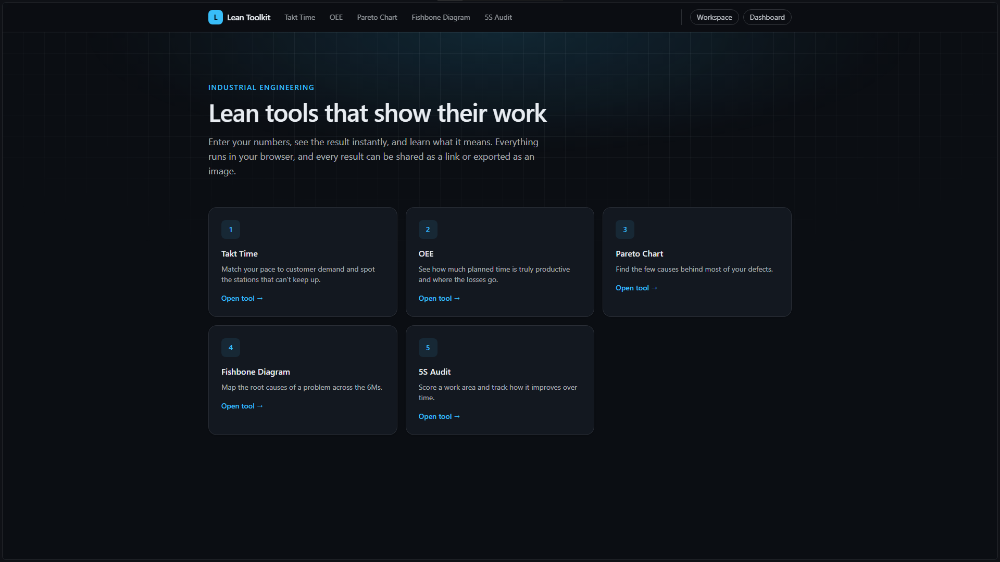
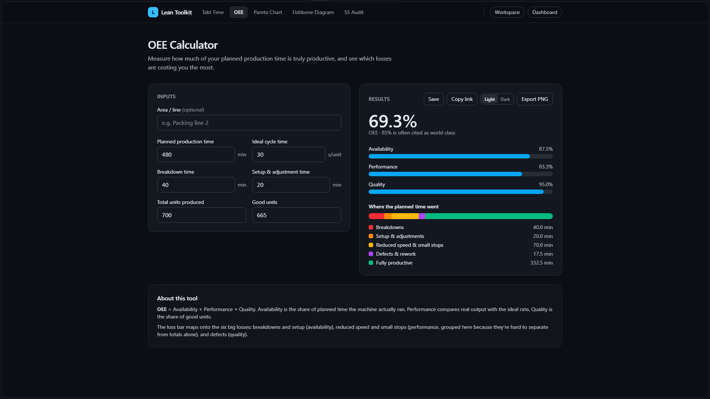
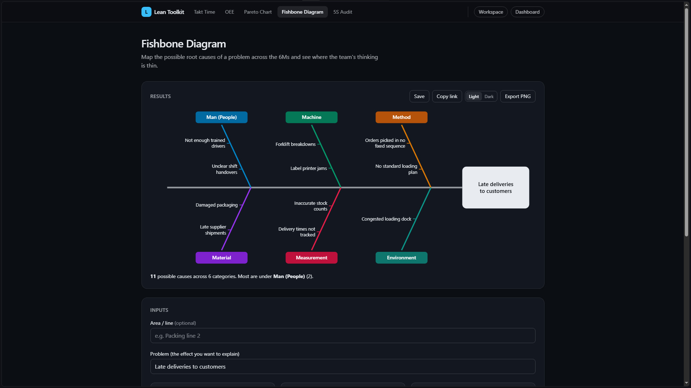
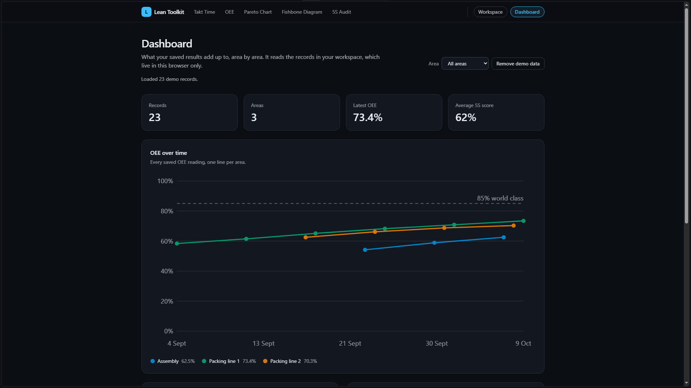

# Lean Toolkit

Calculators and charts for Lean and industrial engineering. Enter your numbers, see the result
instantly, and learn what it means. Everything runs in the browser: no account, no backend.

**Live demo:** https://ie-leanapp.vercel.app



## Tools

| Tool | What it does |
|---|---|
| Takt Time | Computes takt time from demand and available time, flags stations slower than takt and estimates the minimum number of operators. |
| OEE | Availability × performance × quality, with a breakdown of where the planned time went. |
| Pareto Chart | Ranks defect causes, merges duplicates, highlights the vital few and imports pasted Excel or CSV data. |
| 5S Audit | Scores a work area against the five S's, handles partial audits and points to the weakest one. |
| Fishbone Diagram | Maps causes across the 6Ms, with a layout that grows with the content. |




## Workspace and dashboard

Every tool can **save** its result as a record (`tool`, `area`, `date`, `values`). The
**Workspace** lists saved records, and records can be exported and imported as JSON. The
**Dashboard** turns them into a team-style overview, per area:

- OEE over time, with the 85% world-class reference
- Combined top defect causes (the latest Pareto of each area, so repeated saves are not double-counted)
- 5S score per area with the weakest pillar
- Takt time and bottleneck per line

A "Load demo data" button fills the dashboard with sample records.



## Features

- Shareable links that restore a tool's inputs (state lives in the URL hash)
- PNG export of results in a light or dark theme, with an optional area label in the header
- Installable as an app (PWA), with an offline fallback for pages you have already opened
- Light and dark mode, reduced-motion support, keyboard-friendly forms with visible focus

## Tech stack

Next.js (App Router), TypeScript, Tailwind CSS v4, Vitest. Charts and the fishbone diagram are
hand-written SVG.
## Getting started

```bash
npm install
npm run dev     # http://localhost:3000
npm test        # unit tests
npm run build   # production build
```

## Project structure

```
app/            routes: one page per tool, plus workspace and dashboard
components/     UI; one component per tool in components/tools, animation helpers in components/fx
hooks/          reading shared links, saved records, motion and color scheme preferences
lib/lean/       pure TypeScript formulas and layout logic, with tests
lib/share/      link codec and state validators, with tests
lib/workspace/  record logic and browser storage, with tests
lib/dashboard/  aggregation per area and demo data, with tests
types/          shared types
```

## Roadmap

- Team workspace: sign in, share records with a team and see live updates on the dashboard
- Value stream map editor and Kanban/WIP simulator
- Native mobile packaging